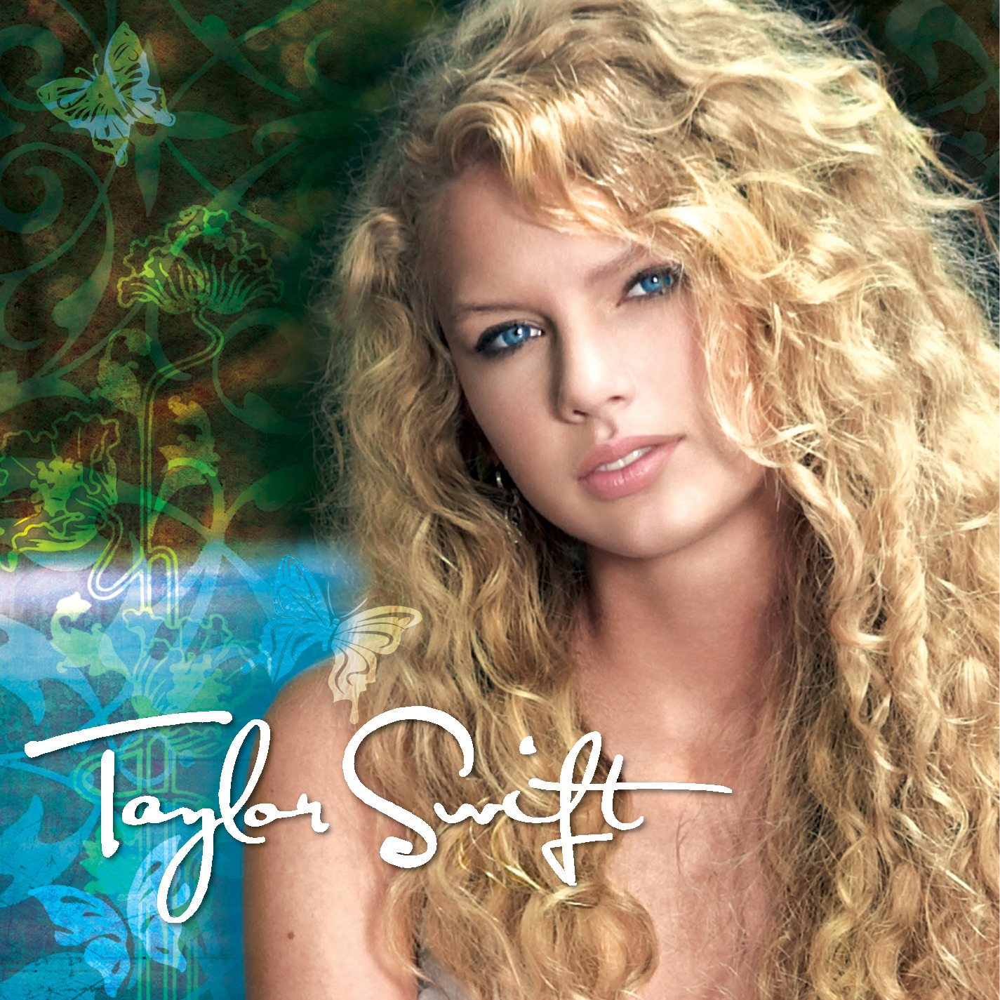
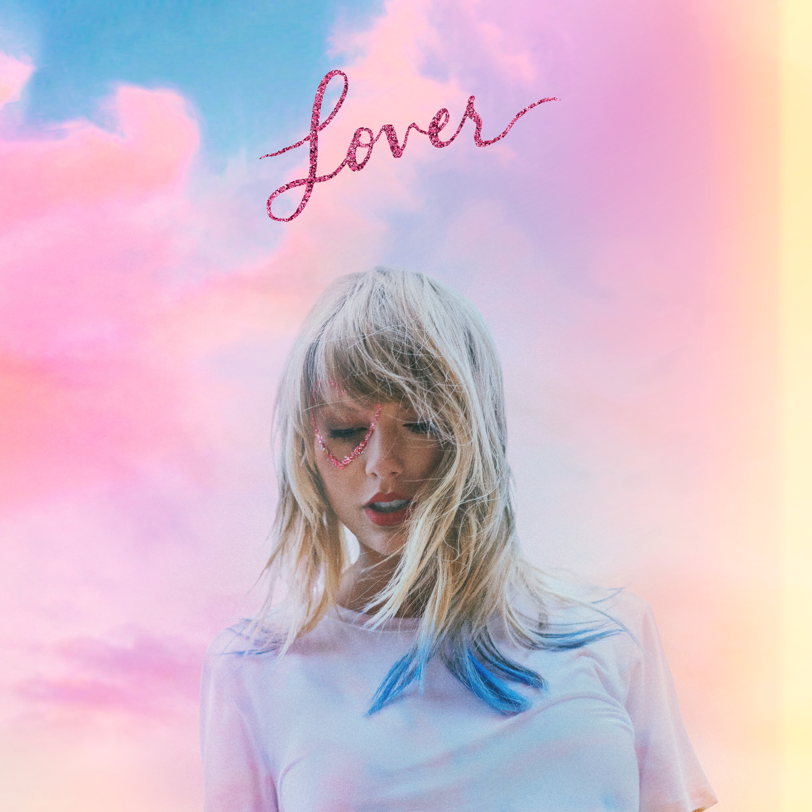

Select an album to compare it with the most similar and most different covers based on color distance:

```{=html}
<div class="mb-4">
  <label for="album-select" class="form-label fw-bold">Select Album:</label>
  <select id="album-select" class="form-select" style="max-width: 360px;">
    <option value="taylor_swift">Taylor Swift (2006)</option>
    <option value="fearless">Fearless (2008)</option>
    <option value="speak_now">Speak Now (2010)</option>
    <option value="red">Red (2012)</option>
    <option value="1989">1989 (2014)</option>
    <option value="reputation">reputation (2017)</option>
    <option value="lover">Lover (2019)</option>
    <option value="folklore">folklore (2020)</option>
    <option value="evermore">evermore (2020)</option>
    <option value="midnights">Midnights (2022)</option>
    <option value="the_tortured_poets_department">The Tortured Poets Department (2024)</option>
  </select>
</div>

<div style="max-width: 520px;">
  <div class="card p-3 shadow-sm mb-3 text-center">
    <h6 class="text-uppercase text-muted fw-bold">Selected Album</h6>
    <p id="selected-title" class="fw-semibold mb-2">Taylor Swift (2006)</p>
    
  </div>

  <div class="row g-3">
    <div class="col-6 text-center">
      <div class="card h-100 p-3 shadow-sm border-success">
        <h6 class="text-uppercase text-success fw-bold">Most Similar</h6>
        <p id="similar-title" class="fw-semibold mb-2">evermore (2020)</p>
        
      </div>
    </div>
    <div class="col-6 text-center">
      <div class="card h-100 p-3 shadow-sm border-danger">
        <h6 class="text-uppercase text-danger fw-bold">Most Different</h6>
        <p id="different-title" class="fw-semibold mb-2">Lover (2019)</p>
        
      </div>
    </div>
  </div>
</div>

<script>
const albumData = {
  taylor_swift: { title: "Taylor Swift (2006)", file: "data/swift/taylor_swift.jpg", closest: "evermore", furthest: "lover" },
  fearless: { title: "Fearless (2008)", file: "data/swift/fearless.jpg", closest: "1989", furthest: "red" },
  speak_now: { title: "Speak Now (2010)", file: "data/swift/speak_now.jpg", closest: "folklore", furthest: "red" },
  red: { title: "Red (2012)", file: "data/swift/red.jpg", closest: "evermore", furthest: "lover" },
  1989: { title: "1989 (2014)", file: "data/swift/1989.jpg", closest: "fearless", furthest: "red" },
  reputation: { title: "reputation (2017)", file: "data/swift/reputation.jpg", closest: "folklore", furthest: "red" },
  lover: { title: "Lover (2019)", file: "data/swift/lover.jpg", closest: "the_tortured_poets_department", furthest: "red" },
  folklore: { title: "folklore (2020)", file: "data/swift/folklore.jpg", closest: "reputation", furthest: "red" },
  evermore: { title: "evermore (2020)", file: "data/swift/evermore.jpg", closest: "taylor_swift", furthest: "lover" },
  midnights: { title: "Midnights (2022)", file: "data/swift/midnights.jpg", closest: "reputation", furthest: "red" },
  the_tortured_poets_department: { title: "The Tortured Poets Department (2024)", file: "data/swift/the_tortured_poets_department.jpg", closest: "lover", furthest: "red" }
};

document.getElementById('album-select').addEventListener('change', function() {
  const chosen = albumData[this.value];
  const sim = albumData[chosen.closest];
  const diff = albumData[chosen.furthest];

  document.getElementById('selected-title').textContent = chosen.title;
  document.getElementById('selected-img').src = chosen.file;

  document.getElementById('similar-title').textContent = sim.title;
  document.getElementById('similar-img').src = sim.file;

  document.getElementById('different-title').textContent = diff.title;
  document.getElementById('different-img').src = diff.file;
});
</script>
```
